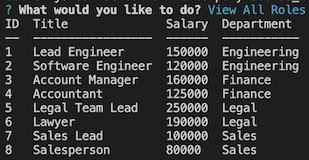
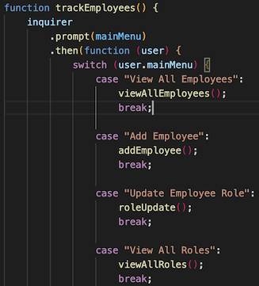

# SQL Employee Tracker

## Description 

Here we have a command line application that creates a interactive employee database. The database is broken down into connected tables that allow you to view different parameters. It also allows for a small updates. This was built as a simple application to be able to manage employees of a buisness. 

In this application we employee the use of three main node packages: console-table, mysql, and inquirer. 

Please view the following video to see the application in action: 

[Video of Employee Tracker](https://youtu.be/v15o7qV3Uo0)

## Installation

First clone the repo and open the folder in a intergrated terminal. Then run "npm i" to install the independencies. Console-table is used to console.log out a nice formatted table. Mysql is used to maintain the database. Inquierer is used for the prompts in the command line. Next you will run mysql. The schema creates the database and the tables. The seeds will fill the table with data for us to demonstrate its usage. And the test file is there to test the queries. 

After running mysql, exit and enter "node server" to start up the application. From here it is running in your command line interface. 

## Usage 

In this first photo here, you can see the View All Roles table in action. When you select that function, the table appears. 

This next photo is a portion of the main function. This is the switch statement that will controls what you want to do. This is what does the heavy lifting of the application. The view queries are all in the server.js file. Any functions you want that will alter data are in their own file. This was made to help modulize the aplication. 

